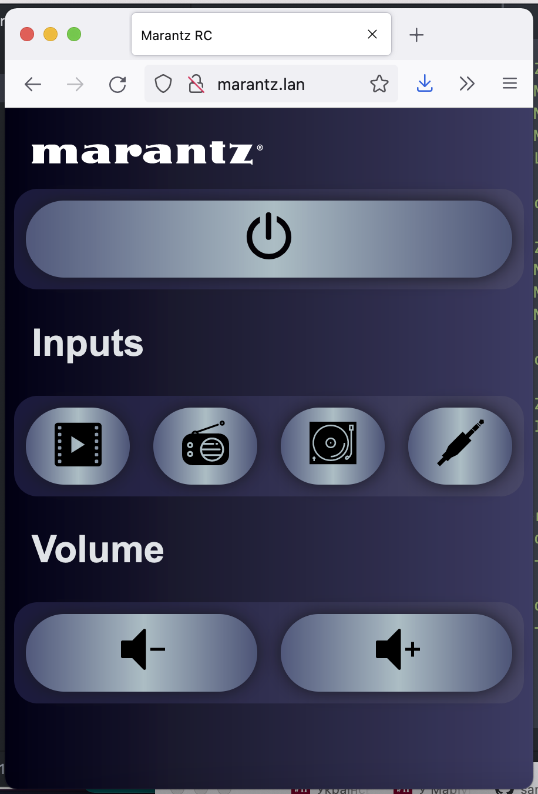

# Marantz ESP32 based remote control

Web based remote control for Matantz amplifier using ESP32.

## About

This project implements web interface usable from mobile/tablet/desktop for my old Marantz amplifier.
It is using "Remote IN" socket and ESP32 GPIO output.
I had to connect it via diode (i used **1N5408** but +- any should work) to avoid current from amplifier to the board when infrared RC is used.

You can find more about Marantz remote socket and wire protocol in my [blog post](https://smallhacks.wordpress.com/2021/07/07/controlling-marantz-amplifier-using-arduino-via-remote-socket/).

## Some implementation notes

Project is using [ESPAsyncWebServer](https://github.com/me-no-dev/ESPAsyncWebServer)
to provide HTTP and implements 2 endpoints: `/` to output HTML web page (with all embedded images and simple js) and `/update?button=<id>` which allows to send commands to the device. Supported ID-s are "standby, phono, cd, tuner, aux1, aux2, dcc, tape, volume_up, volume_down". All SVG icons are embedded to the source code, you can use SPIFFS if you prefer them to be served as files.

Initially device WIFI latency was very unstable, so power manager was disabled to fix that. In my code there is also bssid selection, to ensure that device always connects to the room AP. Remove it if you have only one AP or set according to your BSSID value.

HTML source could be found in the [html.h](html.h) header, it is using some rudimentary scripting (e.g. `onclick` instead of DOM listeners) to be compatible with my older iPad. Protocol is one-way, so its not possible to grab device status. HTTP was choosen as it is compatible with any web browser.

## Screenshot

